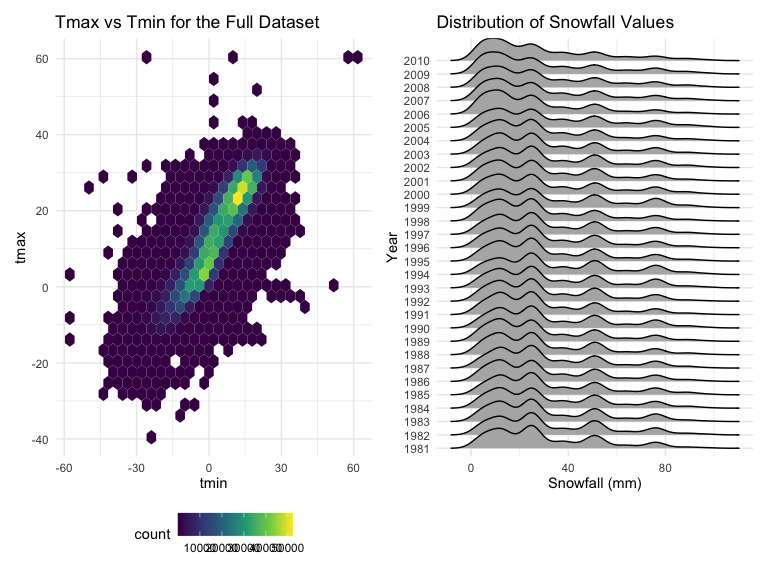

P8105 Homework 3
================

## Problem 1

#### Read in the data

``` r
data("instacart")

instacart = 
  instacart %>% 
  as_tibble(instacart)
```

#### Answer questions about the data

This dataset contains 1384617 rows and 15 columns, with each row
resprenting a single product from an instacart order. Variables include
identifiers for user, order, and product; the order in which each
product was added to the cart. There are several order-level variables,
describing the day and time of the order, and number of days since prior
order. Then there are several item-specific variables, describing the
product name (e.g. Yogurt, Avocado), department (e.g. dairy and eggs,
produce), and aisle (e.g. yogurt, fresh fruits), and whether the item
has been ordered by this user in the past. In total, there are 39123
products found in 131209 orders from 131209 distinct users.

Below is a table summarizing the number of items ordered from aisle. In
total, there are 134 aisles, with fresh vegetables and fresh fruits
holding the most items ordered by far.

``` r
instacart %>% 
  count(aisle) %>% 
  arrange(desc(n))
```

    ## # A tibble: 134 × 2
    ##    aisle                              n
    ##    <chr>                          <int>
    ##  1 fresh vegetables              150609
    ##  2 fresh fruits                  150473
    ##  3 packaged vegetables fruits     78493
    ##  4 yogurt                         55240
    ##  5 packaged cheese                41699
    ##  6 water seltzer sparkling water  36617
    ##  7 milk                           32644
    ##  8 chips pretzels                 31269
    ##  9 soy lactosefree                26240
    ## 10 bread                          23635
    ## # … with 124 more rows
    ## # ℹ Use `print(n = ...)` to see more rows

Next is a plot that shows the number of items ordered in each aisle.
Here, aisles are ordered by ascending number of items.

``` r
instacart %>% 
  count(aisle) %>% 
  filter(n > 10000) %>% 
  mutate(aisle = fct_reorder(aisle, n)) %>% 
  ggplot(aes(x = aisle, y = n)) + 
  geom_point() + 
  labs(title = "Number of items ordered in each aisle") +
  theme(axis.text.x = element_text(angle = 60, hjust = 1))
```


Our next table shows the three most popular items in aisles
`baking ingredients`, `dog food care`, and `packaged vegetables fruits`,
and includes the number of times each item is ordered in the table.

``` r
instacart %>% 
  filter(aisle %in% c("baking ingredients", "dog food care", "packaged vegetables fruits")) %>%
  group_by(aisle) %>% 
  count(product_name) %>% 
  mutate(rank = min_rank(desc(n))) %>% 
  filter(rank < 4) %>% 
  arrange(desc(n)) %>%
  knitr::kable()
```

| aisle                      | product_name                                  |    n | rank |
|:---------------------------|:----------------------------------------------|-----:|-----:|
| packaged vegetables fruits | Organic Baby Spinach                          | 9784 |    1 |
| packaged vegetables fruits | Organic Raspberries                           | 5546 |    2 |
| packaged vegetables fruits | Organic Blueberries                           | 4966 |    3 |
| baking ingredients         | Light Brown Sugar                             |  499 |    1 |
| baking ingredients         | Pure Baking Soda                              |  387 |    2 |
| baking ingredients         | Cane Sugar                                    |  336 |    3 |
| dog food care              | Snack Sticks Chicken & Rice Recipe Dog Treats |   30 |    1 |
| dog food care              | Organix Chicken & Brown Rice Recipe           |   28 |    2 |
| dog food care              | Small Dog Biscuits                            |   26 |    3 |

Finally is a table showing the mean hour of the day at which Pink Lady
Apples and Coffee Ice Cream are ordered on each day of the week. This
table has been formatted in an untidy manner for human readers. Pink
Lady Apples are generally purchased slightly earlier in the day than
Coffee Ice Cream, with the exception of day 5.

``` r
instacart %>%
  filter(product_name %in% c("Pink Lady Apples", "Coffee Ice Cream")) %>%
  group_by(product_name, order_dow) %>%
  summarize(mean_hour = mean(order_hour_of_day)) %>%
  spread(key = order_dow, value = mean_hour) %>%
  knitr::kable(digits = 2)
```

    ## `summarise()` has grouped output by 'product_name'. You can override using the
    ## `.groups` argument.

| product_name     |     0 |     1 |     2 |     3 |     4 |     5 |     6 |
|:-----------------|------:|------:|------:|------:|------:|------:|------:|
| Coffee Ice Cream | 13.77 | 14.32 | 15.38 | 15.32 | 15.22 | 12.26 | 13.83 |
| Pink Lady Apples | 13.44 | 11.36 | 11.70 | 14.25 | 11.55 | 12.78 | 11.94 |

## Problem 2

#### Read in the data

``` r
accel_df = read_csv("./data/accel_data.csv",
                    col_types = cols(week = "i", day_id = "i"))

accel_df
```

    ## # A tibble: 35 × 1,443
    ##     week day_id day      activ…¹ activ…² activ…³ activ…⁴ activ…⁵ activ…⁶ activ…⁷
    ##    <int>  <int> <chr>      <dbl>   <dbl>   <dbl>   <dbl>   <dbl>   <dbl>   <dbl>
    ##  1     1      1 Friday      88.4    82.2    64.4    70.0    75.0    66.3    53.8
    ##  2     1      2 Monday       1       1       1       1       1       1       1  
    ##  3     1      3 Saturday     1       1       1       1       1       1       1  
    ##  4     1      4 Sunday       1       1       1       1       1       1       1  
    ##  5     1      5 Thursday    47.4    48.8    46.9    35.8    49.0    44.8    73.4
    ##  6     1      6 Tuesday     64.8    59.5    73.7    45.7    42.4    58.4    76.8
    ##  7     1      7 Wednesd…    71.1   103.     68.5    45.4    37.8    18.3    27.5
    ##  8     2      8 Friday     675     542    1010     779     509     106     637  
    ##  9     2      9 Monday     291     335     393     335     263     675     213  
    ## 10     2     10 Saturday    64      11       1       1       1       1       1  
    ## # … with 25 more rows, 1,433 more variables: activity.8 <dbl>,
    ## #   activity.9 <dbl>, activity.10 <dbl>, activity.11 <dbl>, activity.12 <dbl>,
    ## #   activity.13 <dbl>, activity.14 <dbl>, activity.15 <dbl>, activity.16 <dbl>,
    ## #   activity.17 <dbl>, activity.18 <dbl>, activity.19 <dbl>, activity.20 <dbl>,
    ## #   activity.21 <dbl>, activity.22 <dbl>, activity.23 <dbl>, activity.24 <dbl>,
    ## #   activity.25 <dbl>, activity.26 <dbl>, activity.27 <dbl>, activity.28 <dbl>,
    ## #   activity.29 <dbl>, activity.30 <dbl>, activity.31 <dbl>, …
    ## # ℹ Use `print(n = ...)` to see more rows, and `colnames()` to see all variable names

``` r
colnames(accel_df)[ncol(accel_df)]
```

    ## [1] "activity.1440"

The raw dataset has 35 rows and 1443 columns, and each row represents
one single day, containing 1440 activity counts values, which is hard to
read. So, we are going to transform wide to long.

#### Clean, tidy, and encode

``` r
accel_tidy = accel_df %>% 
  janitor::clean_names() %>% 
  pivot_longer(
    activity_1:activity_1440,
    names_to = "minute",
    names_prefix = "activity_",
    values_to = "activity_counts"
  ) %>% 
    mutate(
      weekday_vs_weekend = ifelse(day %in% c("Saturday", "Sunday"), "weekend", "weekday"),
      minute = as.integer(minute)
      ) %>% 
  select(week, day_id, day, weekday_vs_weekend, everything())

accel_tidy
```

    ## # A tibble: 50,400 × 6
    ##     week day_id day    weekday_vs_weekend minute activity_counts
    ##    <int>  <int> <chr>  <chr>               <int>           <dbl>
    ##  1     1      1 Friday weekday                 1            88.4
    ##  2     1      1 Friday weekday                 2            82.2
    ##  3     1      1 Friday weekday                 3            64.4
    ##  4     1      1 Friday weekday                 4            70.0
    ##  5     1      1 Friday weekday                 5            75.0
    ##  6     1      1 Friday weekday                 6            66.3
    ##  7     1      1 Friday weekday                 7            53.8
    ##  8     1      1 Friday weekday                 8            47.8
    ##  9     1      1 Friday weekday                 9            55.5
    ## 10     1      1 Friday weekday                10            43.0
    ## # … with 50,390 more rows
    ## # ℹ Use `print(n = ...)` to see more rows

The resulting dataset has 35 rows and 1443 columns. Variables include
the week, day_id, day, weekday or weekend indicator, minute, and
activity counts value. Each row represents the record of every minute.
In total, there are 35 days from 5 weeks.

Next let’s make traditional analyses of accelerometer data focus on the
total activity over the day. Using the tidied dataset, aggregate across
minutes to create a total activity variable for each day, and create a
table showing these totals. Are any trends apparent?

``` r
accel_tidy %>% 
  group_by(week, day) %>% 
  summarize(total_activity = sum(activity_counts, na.rm = TRUE)) %>% 
  pivot_wider(
    names_from = day,
    values_from = total_activity
  ) %>% 
  knitr::kable()
```

    ## `summarise()` has grouped output by 'week'. You can override using the
    ## `.groups` argument.

| week |   Friday |    Monday | Saturday | Sunday | Thursday |  Tuesday | Wednesday |
|-----:|---------:|----------:|---------:|-------:|---------:|---------:|----------:|
|    1 | 480542.6 |  78828.07 |   376254 | 631105 | 355923.6 | 307094.2 |    340115 |
|    2 | 568839.0 | 295431.00 |   607175 | 422018 | 474048.0 | 423245.0 |    440962 |
|    3 | 467420.0 | 685910.00 |   382928 | 467052 | 371230.0 | 381507.0 |    468869 |
|    4 | 154049.0 | 409450.00 |     1440 | 260617 | 340291.0 | 319568.0 |    434460 |
|    5 | 620860.0 | 389080.00 |     1440 | 138421 | 549658.0 | 367824.0 |    445366 |

It is apparent that most of total activity values for each day have
exceeded 100,000, except the Monday in week 1, the Saturday in week 4,
and the Saturday in week 5. Among them, the Monday in week 1 has total
activity value near 100,000, which is 78828. But those two Saturdays
both have only 1440 counts for the whole day, which is abnormal compared
with other days.

Then we will make a single-panel plot that shows the 24-hour activity
time courses for each day and use color to indicate day of the week.
Describe in words any patterns or conclusions you can make based on this
graph.

``` r
accel_tidy %>% 
  mutate(hour = as.integer((minute-1)/60)) %>% 
  group_by(day_id, hour) %>% 
  mutate(hour_activty = sum(activity_counts)) %>% 
  group_by(day, hour) %>% 
  summarize(avg_hour_act = mean(hour_activty)) %>% 
  ggplot(aes(x = hour, y = avg_hour_act, color = day)) +
  geom_path() +
  labs(
    x = "Hours in a Day",
    y = "Average Activity Counts Per Hour",
    title = "Plot of 24-hour activity time courses"
  ) +
  scale_x_continuous(
    breaks = 0:23,
    labels = c(0:23)
  )
```

    ## `summarise()` has grouped output by 'day'. You can override using the `.groups`
    ## argument.


Generally, the patient has two main activity peaks within a day, which
is around 10:00 \~ 11:00 in the morning and 8:00 \~ 9:00 at night
respectively. The activity values tend to be zero from 23:00 to 4:00 the
next day. With regard to different days, the patient has the largest
morning activity counts on Sunday and has the largest evening activity
counts on Friday.

## Problem 3

#### Read in the data

``` r
data("ny_noaa")

ny_noaa = 
  ny_noaa %>% 
  as_tibble(ny_noaa)

ny_noaa
```

    ## # A tibble: 2,595,176 × 7
    ##    id          date        prcp  snow  snwd tmax  tmin 
    ##    <chr>       <date>     <int> <int> <int> <chr> <chr>
    ##  1 US1NYAB0001 2007-11-01    NA    NA    NA <NA>  <NA> 
    ##  2 US1NYAB0001 2007-11-02    NA    NA    NA <NA>  <NA> 
    ##  3 US1NYAB0001 2007-11-03    NA    NA    NA <NA>  <NA> 
    ##  4 US1NYAB0001 2007-11-04    NA    NA    NA <NA>  <NA> 
    ##  5 US1NYAB0001 2007-11-05    NA    NA    NA <NA>  <NA> 
    ##  6 US1NYAB0001 2007-11-06    NA    NA    NA <NA>  <NA> 
    ##  7 US1NYAB0001 2007-11-07    NA    NA    NA <NA>  <NA> 
    ##  8 US1NYAB0001 2007-11-08    NA    NA    NA <NA>  <NA> 
    ##  9 US1NYAB0001 2007-11-09    NA    NA    NA <NA>  <NA> 
    ## 10 US1NYAB0001 2007-11-10    NA    NA    NA <NA>  <NA> 
    ## # … with 2,595,166 more rows
    ## # ℹ Use `print(n = ...)` to see more rows

This raw dataset contains 2595176 rows and 7 columns, with each row
resprenting a single date from one single weather station. Variables
include identifiers for weather station, date, precipitation, snowfall,
snow depth, max and min temperature.

Below is a table summarizing the number of observations collected from
each weather station. In total, there are 747 weather stations, and each
station has maximum 10957 observations.

``` r
ny_noaa %>% 
  count(id) %>% 
  arrange(desc(n))
```

    ## # A tibble: 747 × 2
    ##    id              n
    ##    <chr>       <int>
    ##  1 USC00300055 10957
    ##  2 USC00300343 10957
    ##  3 USC00300889 10957
    ##  4 USC00304772 10957
    ##  5 USC00304836 10957
    ##  6 USC00304912 10957
    ##  7 USC00305426 10957
    ##  8 USC00305714 10957
    ##  9 USC00306196 10957
    ## 10 USC00309425 10957
    ## # … with 737 more rows
    ## # ℹ Use `print(n = ...)` to see more rows

Missing data pattern:

``` r
missing = ny_noaa %>% 
  gather(key = "key", value = "val") %>% 
  mutate(is_missing = is.na(val)) %>%
  group_by(key, is_missing) %>%
  summarize(n_obs = n()) %>% 
  arrange(key)
```

    ## `summarise()` has grouped output by 'key'. You can override using the `.groups`
    ## argument.

``` r
missing
```

    ## # A tibble: 12 × 3
    ## # Groups:   key [7]
    ##    key   is_missing   n_obs
    ##    <chr> <lgl>        <int>
    ##  1 date  FALSE      2595176
    ##  2 id    FALSE      2595176
    ##  3 prcp  FALSE      2449338
    ##  4 prcp  TRUE        145838
    ##  5 snow  FALSE      2213955
    ##  6 snow  TRUE        381221
    ##  7 snwd  FALSE      2003390
    ##  8 snwd  TRUE        591786
    ##  9 tmax  FALSE      1460818
    ## 10 tmax  TRUE       1134358
    ## 11 tmin  FALSE      1460756
    ## 12 tmin  TRUE       1134420

``` r
missing %>%
  ggplot(aes(x = key, y = n_obs, fill = is_missing)) +
  geom_bar(stat = "identity")
```


The table shows that there is no missing value for variables `date` and
`id`. Missing value counts for variables `prcp`, `snow`, and `snwd` are
145838, 381221, and 591786. But for `tmax` and `tmin`, the counts are
both over 1,000,000, which are near half of observations. According to
the bar plot, we can see that the missing values for `tmax` and `tmin`
have taken on the biggest proportion, and `prcp` has the smallest
(except `date` and `id`). Just by eyeballing, the total amount of
missing value (the yellow chunk) from the raw data set has taken on
about one fourth of the whole record.

#### Answer the questions

-   Do some data cleaning. Create separate variables for year, month,
    and day. Ensure observations for temperature, precipitation, and
    snowfall are given in reasonable units. For snowfall, what are the
    most commonly observed values? Why?

``` r
noaa_tidy = ny_noaa %>%
  janitor::clean_names() %>% 
  mutate(
    year = as.integer(format(as.Date(date), "%Y")),
    month = month.name[as.integer(format(as.Date(date), "%m"))],
    day = as.integer(format(as.Date(date), "%d")),
    tmin = as.numeric(tmin) / 10,
    tmax = as.numeric(tmax) / 10,
    prcp = prcp / 10
    )

noaa_tidy
```

    ## # A tibble: 2,595,176 × 10
    ##    id          date        prcp  snow  snwd  tmax  tmin  year month      day
    ##    <chr>       <date>     <dbl> <int> <int> <dbl> <dbl> <int> <chr>    <int>
    ##  1 US1NYAB0001 2007-11-01    NA    NA    NA    NA    NA  2007 November     1
    ##  2 US1NYAB0001 2007-11-02    NA    NA    NA    NA    NA  2007 November     2
    ##  3 US1NYAB0001 2007-11-03    NA    NA    NA    NA    NA  2007 November     3
    ##  4 US1NYAB0001 2007-11-04    NA    NA    NA    NA    NA  2007 November     4
    ##  5 US1NYAB0001 2007-11-05    NA    NA    NA    NA    NA  2007 November     5
    ##  6 US1NYAB0001 2007-11-06    NA    NA    NA    NA    NA  2007 November     6
    ##  7 US1NYAB0001 2007-11-07    NA    NA    NA    NA    NA  2007 November     7
    ##  8 US1NYAB0001 2007-11-08    NA    NA    NA    NA    NA  2007 November     8
    ##  9 US1NYAB0001 2007-11-09    NA    NA    NA    NA    NA  2007 November     9
    ## 10 US1NYAB0001 2007-11-10    NA    NA    NA    NA    NA  2007 November    10
    ## # … with 2,595,166 more rows
    ## # ℹ Use `print(n = ...)` to see more rows

``` r
noaa_tidy %>% 
  count(snow) %>% 
  arrange(desc(n))
```

    ## # A tibble: 282 × 2
    ##     snow       n
    ##    <int>   <int>
    ##  1     0 2008508
    ##  2    NA  381221
    ##  3    25   31022
    ##  4    13   23095
    ##  5    51   18274
    ##  6    76   10173
    ##  7     8    9962
    ##  8     5    9748
    ##  9    38    9197
    ## 10     3    8790
    ## # … with 272 more rows
    ## # ℹ Use `print(n = ...)` to see more rows

The resulting dataset contains 2595176 rows and 10 columns. Variables
include `id`, `date`, `prcp`(mm), `snow`(mm), `snwd`(mm), `tmax`(C),
`tmin`(C), `year`, `month`, and `day`. The most commonly observed values
for snowfall is 0, because for most of the days it was not snowing.

-   Make a two-panel plot showing the average max temperature in January
    and in July in each station across years. Is there any observable /
    interpretable structure? Any outliers?

``` r
noaa_tidy %>% 
  group_by(id, year, month) %>% 
  summarize(mean_tmax = mean(tmax, na.rm = TRUE)) %>% 
  filter(month %in% c("January", "July")) %>% 
  ggplot(aes(x = year, y = mean_tmax, color = month)) + 
  geom_point(alpha = .3) + 
  geom_smooth() + 
  labs(
    title = "Avg Max Temp in Each Station Across Years",
    x = "Year",
    y = "Average Max Temperature (°C)"
  ) +
  scale_x_continuous(
    breaks = c(1980, 1985, 1990, 1995, 2000, 2005, 2010)
    ) +
  facet_grid(. ~ month) +
  theme(legend.position = "none")
```

    ## `summarise()` has grouped output by 'id', 'year'. You can override using the
    ## `.groups` argument.
    ## `geom_smooth()` using method = 'gam' and formula 'y ~ s(x, bs = "cs")'


In January, the average max temperature in each station appear to be
between -10 to 10 Celsius across years. And we can tell that there is
some floating by eyeballing the smooth curve, especially there are three
peaks around 1990, 1999, and 2007. There are some outliers which are
outside the average range, such as in 1982 and 2005, but not apparent.

In July, the average max temperature in each station appear to be
between 20 to 33 Celsius across years. The smooth curve tends to be more
stable compared with January. And we can tell that there is a obvious
outlier in 1988, which is around 15 Celsius. In addition, the average
temperature in January are substantially lower than in July.

-   Make a two-panel plot showing (i) tmax vs tmin for the full dataset
    (note that a scatterplot may not be the best option); and (ii) make
    a plot showing the distribution of snowfall values greater than 0
    and less than 100 separately by year.

``` r
tmax_vs_tmin = noaa_tidy %>% 
  ggplot(aes(x = tmin, y = tmax)) + 
  geom_hex() +
  labs(
    title = "Tmax vs Tmin for the Full Dataset"
  )

snow_fall = noaa_tidy %>% 
  filter(snow > 0 & snow <100) %>% 
  ggplot(aes(x = snow, y = factor(year))) +
  geom_density_ridges() +
  labs(
    title = "Distribution of Snowfall Values",
    x = "Snowfall (mm)",
    y = "Year"
  )

tmax_vs_tmin + snow_fall
```

    ## Picking joint bandwidth of 3.76



From the hexbin plot of tmax vs tmin, we could tell the lighter the
color is, the denser. And there is an apparent linear relationship
between these two variables.

According to the density curves showing the distribution of snowfall
values greater than 0 and less than 100 separately by year, snowfall
values are more likely to fall between 0 \~ 30 mm. There are also small
peaks around 52 mm and 78 mm. No apparent changed with regard to the
distribution of snowfall values across years.
